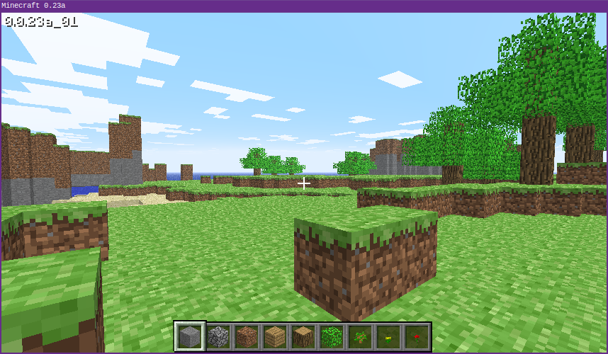

boomcraft
=========



boomcraft is a set of launchers and patches to enable playing old Minecraft
classic versions on a modern Linux JVM (it has long since been removed from
www.minecraft.net).

It currently supports the following game versions, based on what I had available
on my hard drive:

| Version | md5sum of original minecraft.jar |
|---------|----------------------------------|
| `0.0.13a_03` | `5cc32c3110442d305f3f63f1fa1ab4bf` |
| `0.0.23a_01` | `e917487730d0243527dbd27a6df76334` |
| `0.28_01` | `54966f226c043e43440b757d97936699` |
| `0.29_02` | `8951ce03e3c85c56b45556fe6403c642` |
| `0.30` (creative) | `a093fa158dc9d1fa7ec6128c5d77b8a5` |
| `0.30` (survivaltest) | N/A* |

*My JAR for 0.30-survivaltest seems to have the wrong modification date for
terrain.png, so I suspect it was altered at some point (probably to change
texture packs) and thus I don't know what the unmodified md5sum is

Features include:

  * Loading a level from `level.dat`
  * Setting the admin flag to allow breaking bedrock in loaded levels
  * Load sounds from local disk since the files on www.minecraft.net are long
    gone
  * Java bytecode patch to work around the broken Comparator in newer JVMs that
    caused crashes on levels with certain geometry

For intellectual property reasons, I can't distribute the aforementioned JAR
files, nor the resource files, in this repository.  This repo is targeted at
people who already have access to these files and want to reproduce the original
Minecraft Classic experience.  Those looking for an easy way to play classic
should check out [ClassiCube](https://www.classicube.net/), a 3rd-party login
server and clean room implementation of Minecraft Classic in C#.

## TODO

  * Add documentation about how to use it
  * Add documentation about the process of reverse-engineering and fixing
  * Fix `import_jar.py` to distinguish between 0.30-classic and
    0.30-survivaltest to avoid overwriting the destination file
  * Add flag to make sort-patching optional during import
  * Add script to detect Minecraft version from arbitrary JAR files (without
    applying the sort patch)
  * Add convenience wrapper for copying a level to `level.dat` and loading it

## Known Issues

  * In `0.0.13a_03`, there is a bug that causes the mouse input to be choppy
  * `0.0.13a_03` automatically tries to load `level.dat` if it exists, and if
    it's from a different version, the game crashes
  * No support for other OSes besides Linux (pull requests welcome if you get it
    working on Windows or OS X)

## License

0BSD.  See LICENSE.txt

## Resource List

Temporary, while I write actual documentation on how to use it.  LWJGL files can
be downloaded from `http://legacy.lwjgl.org/download.php.html` or taken from an
old version bundled with Minecraft (in my experience, the old version has
problems on Linux).

```
$ tree minecraft/ lib/ native/ resources/
minecraft/
├── minecraft-0.0.13a_03.jar
├── minecraft-0.0.23a_01.jar
├── minecraft-0.28_01.jar
├── minecraft-0.29_02.jar
└── minecraft-0.30.jar
lib/
├── jinput.jar
├── lwjgl-debug.jar
├── lwjgl.jar
├── lwjgl_test.jar
└── lwjgl_util.jar
native/
├── linux
│   ├── libjinput-linux64.so
│   ├── libjinput-linux.so
│   ├── liblwjgl64.so
│   ├── liblwjgl.so
│   ├── libopenal64.so
│   └── libopenal.so
├── macosx
│   ├── libjinput-osx.jnilib
│   ├── liblwjgl.jnilib
│   └── openal.dylib
├── solaris
│   ├── liblwjgl.so
│   └── libopenal.so
└── windows
    ├── jinput-dx8.dll
    ├── jinput-raw.dll
    ├── lwjgl64.dll
    ├── lwjgl.dll
    ├── OpenAL32.dll
    └── OpenAL64.dll
resources/
├── music
│   ├── calm1.ogg
│   ├── calm2.ogg
│   └── calm3.ogg
└── sounds
    └── step
        ├── grass1.ogg
        ├── grass2.ogg
        ├── grass3.ogg
        ├── grass4.ogg
        ├── gravel1.ogg
        ├── gravel2.ogg
        ├── gravel3.ogg
        ├── gravel4.ogg
        ├── stone1.ogg
        ├── stone2.ogg
        ├── stone3.ogg
        ├── stone4.ogg
        ├── wood1.ogg
        ├── wood2.ogg
        ├── wood3.ogg
        └── wood4.ogg
```
